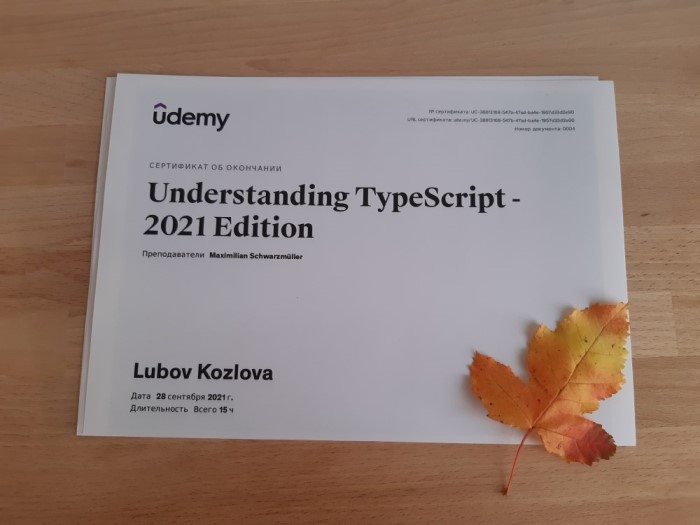

Привет! 

В первом посте похвастюсь прохождением курса - "[Understanding TypeScript -2021 Edition](https://www.udemy.com/course/understanding-typescript/)" от Maximilian Schwarzmüller.

#### Об авторе

Автор немец, но курсы записывает на английском. Язык не сложный, говорит очень четко и размеренно, иногда даже начала ускорять скорость видео)) По началу смотрела с субтитрами, сейчас просто на слух.

Мне очень нравится его бодрая и конструктивная манера изложения, если смотрю утром, то очень хорошо настраивает на рабочий продуктивный день. Заодно и английский потихоньку прокачивается.

#### О курсе

Я программирую на TypeScript уже два года, изучив основы и посмотрев как написаны рабочие проекты. Но давно хотелось углубиться в детали и систематизировать знания. Во время больничного у меня наконец образовалось достаточно времени, чтобы плотно заняться курсом.

Что было нового и полезного для меня: 
* Разобраться во всех предоставляемых типах, часть я раньше не использовала. Разобраться в отличиях any от unknown
* Подробная настройка конфигурации через tsconfig.json. Правда некоторые интересные флаги остались неосвещенными, придется еще копать 
* Систематизировать знания по классам в ts, посмотреть как они компилируется в ES6 и ES5
* Typeof, InstanceOf и Discriminated Unions для определения типа/класса
* Перегрузка функций
* Детали работы Generics, "keyof" Constraint
* Декортаторы **(!)** классов, методов и свойств
* И на сладенькое - написание простенькой апишки на Node / Express / TS. Не совсем ожидаемо в этом курсе, но давно хотела попробовать

В общем, я осталась довольна курсом. Рекомендую всем, кто в такой же ситуации как и я - есть опыт кодинга на ts, но хочется погрузиться детальнее. 
А в идеале конечно начинать с него знакомство с языком.